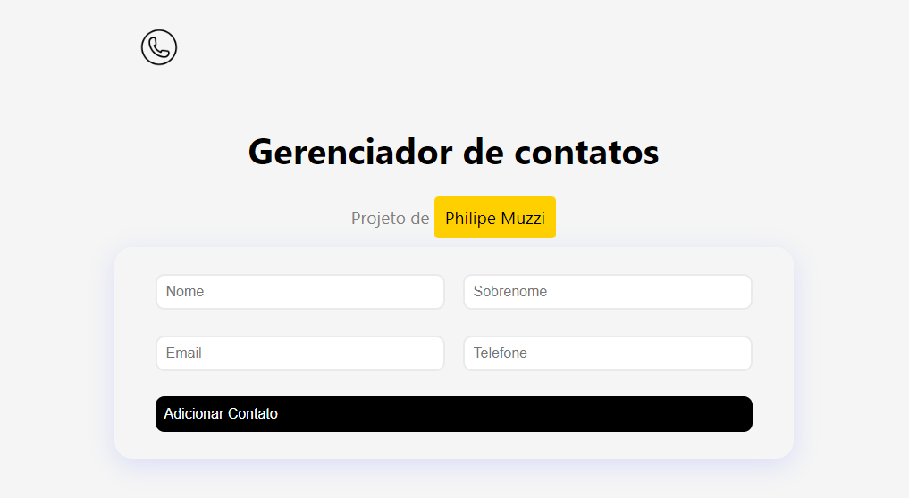
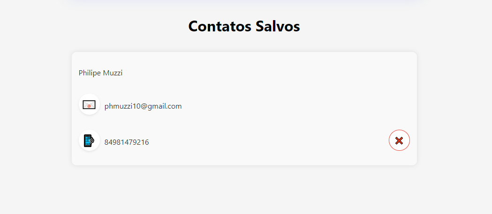
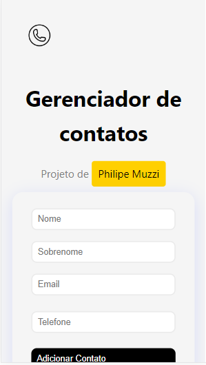

# Gerenciador de Lista Telefônica

## Descrição

Bem-vindo ao gerenciador de lista telefônica! Este pequeno e simples projeto foi desenvolvido para facilitar a organização de contatos telefônicos, sendo também criado para constantemente exercitar conceitos básicos de Java Script, React e Design do usuário.

### Tela Principal:

### Adicionar Contato:

### Tecnologias Utilizadas:

### Para dispositivos móveis:

### Se gostou, deixe uma 🌟🌟🌟 !